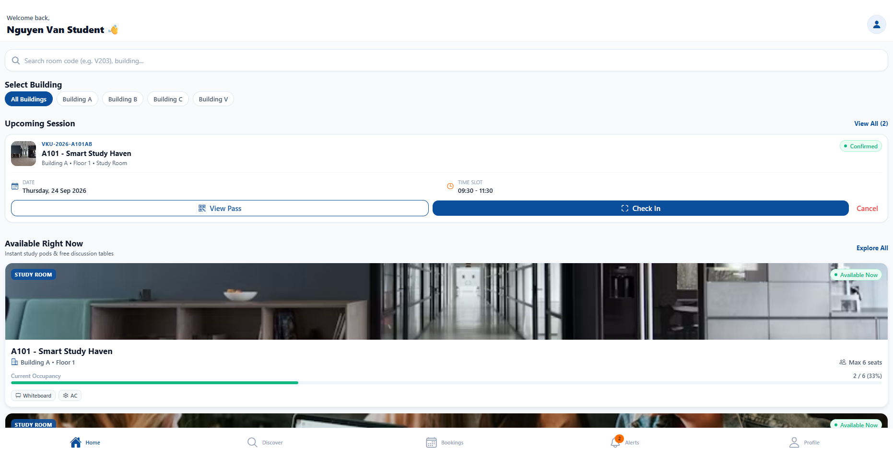
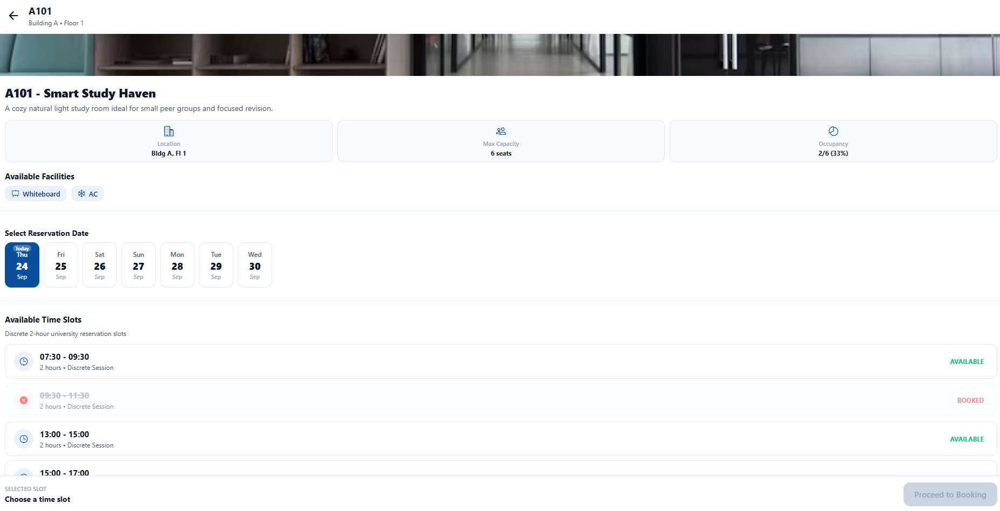
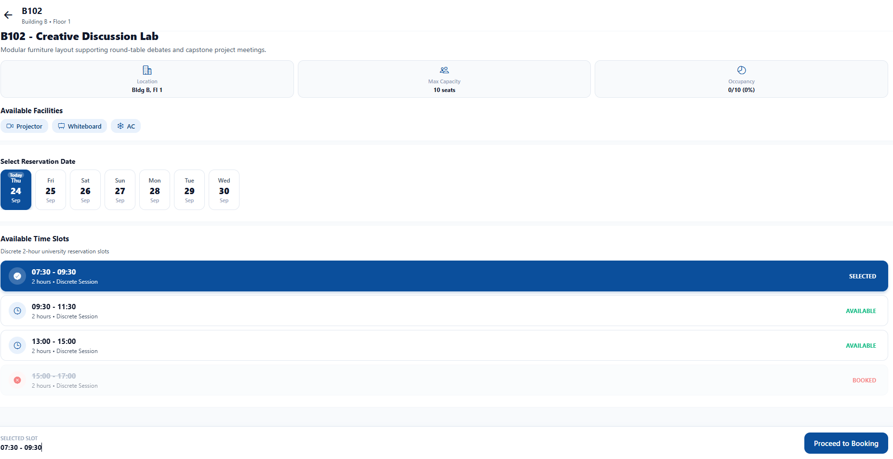
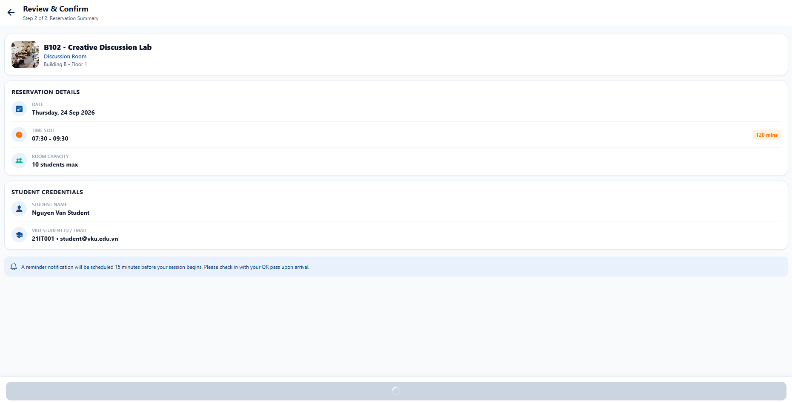

# MINI-PROJECT SHORT TECHNICAL REPORT

**Course:** Cross-Platform Mobile App Development (VKU)

**Mini-Project Title:** Mini-Project 2 – VKU SpaceHub: Campus Room & Computer Lab Booking Manager

**Team / Student Name:** Le Huu Thai

**Submission Date:** [24/09/2026]

---

## 1. GENERAL INFORMATION & DELIVERABLE LINKS

### Team Members

1. Le Huu Thai — Student ID: [23IT.EB091] — Role: [Frontend Architecture & State Management] — Contribution: [100%]

### Deliverable Links

- **Live Demo URL:** https://vku-space-hub.vercel.app
- **GitHub Repository:** https://github.com/HuuThai127/vku-space-hub
- **Video Demo:**(https://drive.google.com/file/d/14KIY_okh8UHoNO_pgYAlJpz4p1nZ6r3c/view?usp=sharing)

---

## 2. FEATURE IMPLEMENTATION CHECKLIST

| # | Required Feature | Status | Implementation Details & Acceptance Level |
|:---:|---|:---:|---|
| 1 | React Native + Expo application | ✅ Complete | Initialized with Expo SDK 57 and React Native 0.86.3. Runs on mobile (iOS/Android via Expo Go / development builds) and web. Cites: [`package.json`](file:///e:/Projects/VKU-SpaceHub/package.json), [`app.json`](file:///e:/Projects/VKU-SpaceHub/app.json), [`App.tsx`](file:///e:/Projects/VKU-SpaceHub/App.tsx). |
| 2 | Global user session management with Zustand | ✅ Complete | Authenticates student, persists session across restarts via `restoreSession()`, and exposes current user profile. Cites: [`src/store/useBookingStore.ts`](file:///e:/Projects/VKU-SpaceHub/src/store/useBookingStore.ts), [`src/services/authService.ts`](file:///e:/Projects/VKU-SpaceHub/src/services/authService.ts). |
| 3 | Global booking state with Zustand | ✅ Complete | Centralized store managing active reservations, booking history, campus-wide bookings, and selection state. Cites: [`src/store/useBookingStore.ts`](file:///e:/Projects/VKU-SpaceHub/src/store/useBookingStore.ts). |
| 4 | Global search/filter state with Zustand | ✅ Complete | Multi-facet filter store maintaining search queries, building, capacity, equipment, room type, and date selections. Cites: [`src/store/useFilterStore.ts`](file:///e:/Projects/VKU-SpaceHub/src/store/useFilterStore.ts). |
| 5 | High-performance FlatList | ✅ Complete | Virtualized list rendering for room listings and reservations with optimized windowing and stable `keyExtractor`. Cites: [`src/screens/discover/DiscoverScreen.tsx`](file:///e:/Projects/VKU-SpaceHub/src/screens/discover/DiscoverScreen.tsx), [`src/screens/reservations/ReservationsScreen.tsx`](file:///e:/Projects/VKU-SpaceHub/src/screens/reservations/ReservationsScreen.tsx). |
| 6 | React.memo RoomCard | ✅ Complete | Room display card wrapped with `React.memo` to eliminate unnecessary re-renders when parent states change. Cites: [`src/components/rooms/RoomCard.tsx`](file:///e:/Projects/VKU-SpaceHub/src/components/rooms/RoomCard.tsx). |
| 7 | Search functionality | ✅ Complete | Real-time text search filtering rooms by name, room code, and description. Cites: [`src/components/common/SearchBar.tsx`](file:///e:/Projects/VKU-SpaceHub/src/components/common/SearchBar.tsx), [`src/screens/discover/DiscoverScreen.tsx`](file:///e:/Projects/VKU-SpaceHub/src/screens/discover/DiscoverScreen.tsx). |
| 8 | Multi-facet filters | ✅ Complete | Filter modal supporting building selection (A, B, C, V), room types (Lab, Lecture Hall, Meeting, Study), minimum capacity, and required equipment. Cites: [`src/components/rooms/FilterModal.tsx`](file:///e:/Projects/VKU-SpaceHub/src/components/rooms/FilterModal.tsx), [`src/store/useFilterStore.ts`](file:///e:/Projects/VKU-SpaceHub/src/store/useFilterStore.ts). |
| 9 | Dynamic 7-day date selector | ✅ Complete | Horizontal calendar strip dynamically calculating the upcoming 7 consecutive calendar days with day-of-week labels. Cites: [`src/components/rooms/DateSelector.tsx`](file:///e:/Projects/VKU-SpaceHub/src/components/rooms/DateSelector.tsx), [`src/utils/dateUtils.ts`](file:///e:/Projects/VKU-SpaceHub/src/utils/dateUtils.ts). |
| 10 | Discrete 2-hour time slots | ✅ Complete | Structured academic booking blocks (`07:30–09:30`, `09:30–11:30`, `13:00–15:00`, `15:00–17:00`) with visual indicators for selected, booked, and available states. Cites: [`src/components/rooms/TimeSlotCard.tsx`](file:///e:/Projects/VKU-SpaceHub/src/components/rooms/TimeSlotCard.tsx), [`src/utils/dateUtils.ts`](file:///e:/Projects/VKU-SpaceHub/src/utils/dateUtils.ts). |
| 11 | Time-slot conflict prevention | ✅ Complete | Mathematical interval-overlap validation engine rejecting duplicate or overlapping bookings on the same room and date. Cites: [`src/utils/conflictEngine.ts`](file:///e:/Projects/VKU-SpaceHub/src/utils/conflictEngine.ts), [`src/services/bookingService.ts`](file:///e:/Projects/VKU-SpaceHub/src/services/bookingService.ts). |
| 12 | Booking creation | ✅ Complete | Full booking creation workflow with confirmation screen, payload validation, and automatic reservation creation. Cites: [`src/screens/booking/BookingConfirmationScreen.tsx`](file:///e:/Projects/VKU-SpaceHub/src/screens/booking/BookingConfirmationScreen.tsx), [`src/store/useBookingStore.ts`](file:///e:/Projects/VKU-SpaceHub/src/store/useBookingStore.ts). |
| 13 | Booking cancellation | ✅ Complete | Interactive cancellation flow with user confirmation alert, status transition to `cancelled`, and slot release. Cites: [`src/screens/reservations/ReservationsScreen.tsx`](file:///e:/Projects/VKU-SpaceHub/src/screens/reservations/ReservationsScreen.tsx), [`src/store/useBookingStore.ts`](file:///e:/Projects/VKU-SpaceHub/src/store/useBookingStore.ts). |
| 14 | Unique booking pass | ✅ Complete | Generation of academic pass records containing unique booking IDs (`BK-xxxxx`), room details, and QR payload. Cites: [`src/screens/booking/BookingPassScreen.tsx`](file:///e:/Projects/VKU-SpaceHub/src/screens/booking/BookingPassScreen.tsx), [`src/screens/booking/BookingSuccessScreen.tsx`](file:///e:/Projects/VKU-SpaceHub/src/screens/booking/BookingSuccessScreen.tsx). |
| 15 | QR check-in modal | ✅ Complete | Renders scannable SVG QR code encoded with booking verification payload and simulates instant check-in verification. Cites: [`src/screens/booking/QRCheckInScreen.tsx`](file:///e:/Projects/VKU-SpaceHub/src/screens/booking/QRCheckInScreen.tsx), [`package.json`](file:///e:/Projects/VKU-SpaceHub/package.json). |
| 16 | Local notification reminder | ✅ Complete | Schedules notifications 15 minutes prior to booking start using `expo-notifications`, with graceful fallback logging on unsupported environments. Cites: [`src/services/notificationService.ts`](file:///e:/Projects/VKU-SpaceHub/src/services/notificationService.ts), [`src/store/useNotificationStore.ts`](file:///e:/Projects/VKU-SpaceHub/src/store/useNotificationStore.ts). |
| 17 | AsyncStorage persistence | ✅ Complete | Offline-first persistent storage for user session, active reservations, booking history, and notification logs. Cites: [`src/services/storageService.ts`](file:///e:/Projects/VKU-SpaceHub/src/services/storageService.ts). |
| 18 | Real-time availability simulation/foundation | ✅ Complete | Observer subscription pattern simulating real-time occupancy updates and dynamic capacity shifts across campus rooms. Cites: [`src/services/roomService.ts`](file:///e:/Projects/VKU-SpaceHub/src/services/roomService.ts), [`src/store/useRoomStore.ts`](file:///e:/Projects/VKU-SpaceHub/src/store/useRoomStore.ts). |
| 19 | Loading/error/empty states | ✅ Complete | Explicit UI feedback including activity spinners, "No rooms found" filter empty states, and "No active reservations" tab placeholders. Cites: [`src/components/common/LoadingIndicator.tsx`](file:///e:/Projects/VKU-SpaceHub/src/components/common/LoadingIndicator.tsx), [`src/screens/discover/DiscoverScreen.tsx`](file:///e:/Projects/VKU-SpaceHub/src/screens/discover/DiscoverScreen.tsx). |
| 20 | TypeScript validation | ✅ Complete | Strict typing across data models, navigation route parameter lists, and component interfaces with zero type errors (`tsc --noEmit`). Cites: [`src/types/index.ts`](file:///e:/Projects/VKU-SpaceHub/src/types/index.ts), [`src/navigation/types.ts`](file:///e:/Projects/VKU-SpaceHub/src/navigation/types.ts), [`tsconfig.json`](file:///e:/Projects/VKU-SpaceHub/tsconfig.json). |
| 21 | Automated tests | ✅ Complete | Verification test suite executing 19 test cases covering conflict detection, interval math, status transitions, and multi-facet filtering. Cites: [`src/utils/__tests__/runTests.js`](file:///e:/Projects/VKU-SpaceHub/src/utils/__tests__/runTests.js), [`package.json`](file:///e:/Projects/VKU-SpaceHub/package.json). |

---

## 3. TECHNICAL ARCHITECTURE & PROJECT STRUCTURE

### 3.1 Technology Stack

The project dependencies and runtime tools are specified in [`package.json`](file:///e:/Projects/VKU-SpaceHub/package.json):

- **React Native (`0.86.3`)**: Core mobile component and native bridge framework.
- **Expo SDK (`~57.0.24`)**: Development platform, native asset pipeline, and build tooling.
- **TypeScript (`~6.0.3`)**: Static type checking and interface contracts across components and stores.
- **Zustand (`^5.0.15`)**: Lightweight, centralized state management without boilerplate.
- **React Navigation (`^7.4.1`)**: Component-based routing system with native stack (`^7.19.2`) and bottom tab (`^7.19.2`) navigators.
- **AsyncStorage (`2.2.0`)**: Unencrypted, asynchronous key-value storage engine for offline data persistence.
- **Expo Notifications (`~57.0.20`)**: Native local push notifications and scheduled reminders.
- **React Native Web (`^0.21.2`)**: Web abstraction layer enabling cross-platform compilation of React Native components to HTML5/DOM.
- **React Native SVG (`15.15.4`) & QR Code SVG (`^6.3.26`)**: Vector rendering for scannable QR passes.

### 3.2 Project Structure

The project follows a modular, feature-oriented layered structure under `src/`:

```
E:\Projects\VKU-SpaceHub
├── assets/                  # App icons, splash screens, and adaptive assets
├── dist/                    # Static production output generated by Expo web export
├── src/
│   ├── components/          # Reusable presentation and domain components
│   │   ├── booking/         # BookingCard and reservation summary cards
│   │   ├── common/          # AppButton, FilterChip, SearchBar, StatusBadge, ScreenHeader
│   │   └── rooms/           # DateSelector, TimeSlotCard, RoomCard, FilterModal
│   ├── constants/           # Academic mock records (mockData.ts) and style tokens (theme.ts)
│   ├── navigation/          # RootNavigator (NativeStack), MainTabs (BottomTabs), navigation types
│   ├── screens/             # Screen modules organized by user journey
│   │   ├── auth/            # SplashScreen, LoginScreen
│   │   ├── booking/         # BookingConfirmationScreen, BookingSuccessScreen, BookingPassScreen, QRCheckInScreen
│   │   ├── discover/        # DiscoverScreen (room discovery and search)
│   │   ├── home/            # HomeScreen (student overview and fast booking)
│   │   ├── notifications/   # NotificationsScreen (system and reminder alerts)
│   │   ├── profile/         # ProfileScreen (account status and settings)
│   │   ├── reservations/    # ReservationsScreen (upcoming and historical passes)
│   │   └── room/            # RoomDetailScreen (slot picker and specifications)
│   ├── services/            # Mock backend services, AsyncStorage wrapper, notification scheduler
│   ├── store/               # Zustand state stores (useBookingStore, useFilterStore, etc.)
│   ├── types/               # TypeScript interfaces for data entities and navigation
│   └── utils/               # Pure helper utilities, conflict engine, and unit tests
│       └── __tests__/       # Automated test suite (runTests.js)
├── App.tsx                  # Root application wrapper with NavigationContainer
├── app.json                 # Expo configuration manifest
├── package.json             # Scripts and versioned dependencies
├── tsconfig.json            # TypeScript compiler configuration
└── vercel.json              # Public Vercel SPA build command and rewrite configuration
```

- **`components/`**: Modular presentational elements decoupled from screen logic.
- **`screens/`**: Primary container components wired to navigation stacks.
- **`navigation/`**: Type-safe navigation layouts defining screen hierarchies and tab bars.
- **`store/`**: Global Zustand stores managing client state slices.
- **`services/`**: Abstraction layer for persistence, simulated network latency, and notification APIs.
- **`utils/`**: Deterministic helper functions (interval math, date formatters, conflict algorithms).
- **`constants/`**: Design tokens (colors, typography, spacing) and campus mock databases.
- **`types/`**: Domain models (`Room`, `Booking`, `TimeSlot`, `User`, `NotificationItem`).

### 3.3 State Management

VKU SpaceHub uses Zustand to manage global state across 4 distinct stores:

```
[ UI Layer: Screens & Components ]
             │
      (Dispatches actions)
             ▼
[ Zustand Global Stores ]
  ├── useBookingStore.ts      ──> User session, active/history reservations
  ├── useFilterStore.ts       ──> Multi-facet search query, building, capacity, equipment
  ├── useRoomStore.ts         ──> Campus rooms list, real-time availability listener
  └── useNotificationStore.ts ──> Unread counter, system alerts, booking reminders
             │
       (Calls async API)
             ▼
[ Service Abstraction Layer ]
  ├── authService.ts          ──> Authentication validation
  ├── bookingService.ts       ──> Conflict checking & booking orchestration
  ├── roomService.ts          ──> Room listing & live occupancy simulation
  ├── storageService.ts       ──> AsyncStorage serialization
  └── notificationService.ts  ──> expo-notifications scheduling
             │
       (Reads / Writes)
             ▼
[ Local Storage / Mock Campus Database ]
```

1. **`useBookingStore`**: Manages the logged-in student user, active reservations, historical bookings, and booking actions (`createBooking`, `cancelBooking`, `checkIn`, `restoreSession`).
2. **`useFilterStore`**: Stores search inputs, selected building filters, minimum capacity, equipment tags, and the currently active date.
3. **`useRoomStore`**: Holds the catalog of campus classrooms and computer labs, providing real-time room availability subscription handling.
4. **`useNotificationStore`**: Manages notification records, unread counters, and mark-as-read operations.

### 3.4 Booking Conflict Prevention

Room overlap validation is implemented as a pure mathematical comparison in [`src/utils/conflictEngine.ts`](file:///e:/Projects/VKU-SpaceHub/src/utils/conflictEngine.ts):

```typescript
export function hasBookingConflict(
  newSlot: Interval,
  existingSlot: Interval
): boolean {
  const newStart = timeToMinutes(newSlot.startTime);
  const newEnd = timeToMinutes(newSlot.endTime);
  const existingStart = timeToMinutes(existingSlot.startTime);
  const existingEnd = timeToMinutes(existingSlot.endTime);

  // Overlap condition:
  return newStart < existingEnd && newEnd > existingStart;
}
```

#### Overlap Rule Explanation

Two time slots conflict if and only if:
$$\text{newStart} < \text{existingEnd} \quad \text{AND} \quad \text{newEnd} > \text{existingStart}$$

- **Conflict Example:**
  - Existing booking: `14:00 – 16:00` (840 min to 960 min)
  - Requested booking: `15:00 – 17:00` (900 min to 1020 min)
  - Calculation: $900 < 960$ (True) AND $1020 > 840$ (True) $\rightarrow$ **Conflict detected (blocked)**.
- **Adjacent / Back-to-Back Example (No Conflict):**
  - Existing booking: `14:00 – 16:00` (840 min to 960 min)
  - Requested booking: `16:00 – 18:00` (960 min to 1080 min)
  - Calculation: $960 < 960$ (False) $\rightarrow$ **No conflict (allowed)**.

The function `checkRoomSlotConflict` executes this check against all active (non-cancelled) bookings for the target room and target date before any reservation is written to storage.

### 3.5 Performance Optimization

To guarantee smooth rendering across both low-end mobile devices and browsers, the codebase uses:

1. **`FlatList` Virtualization**: Utilized in [`DiscoverScreen.tsx`](file:///e:/Projects/VKU-SpaceHub/src/screens/discover/DiscoverScreen.tsx) and [`ReservationsScreen.tsx`](file:///e:/Projects/VKU-SpaceHub/src/screens/reservations/ReservationsScreen.tsx) with explicit `keyExtractor={(item) => item.id}` to recycle view cells and minimize memory footprint.
2. **`React.memo` Memoization**: Implemented on [`RoomCard.tsx`](file:///e:/Projects/VKU-SpaceHub/src/components/rooms/RoomCard.tsx) to prevent re-rendering unchanged room cards during list scrolling or filter updates.
3. **`useCallback` Callbacks**: Applied on event handlers (e.g., `handleRoomPress`, `handleSelectSlot`, `handleCancelBooking`) so prop function references remain stable between parent render cycles.
4. **`useMemo` Computations**: Used for derived values such as calculating dynamic date ranges (`getNext7Days()`), filtering available rooms, and computing percentage occupancy ratios.
5. **Atomic Zustand Selectors**: Components subscribe to specific state slices (e.g., `const user = useBookingStore(s => s.user)`) rather than entire store objects, preventing extraneous re-renders when unrelated properties change.

### 3.6 Notification Architecture

Local notification management is encapsulated in [`src/services/notificationService.ts`](file:///e:/Projects/VKU-SpaceHub/src/services/notificationService.ts):

- **Trigger Calculation**: When a booking is confirmed, the service calculates a target time 15 minutes before slot commencement.
- **Expo Notifications Integration**: Calls `Notifications.scheduleNotificationAsync()` using a `TIME_INTERVAL` trigger input type with sound and banner enabled.
- **Demo Verification Fallback**: If the calculated target trigger date is already within 2 minutes or in the past (common when testing current-day slots), the trigger is set to 5 seconds to provide immediate test feedback.
- **Cross-Platform / Web Graceful Fallback**: Native notification permissions are wrapped in a `try...catch` block. When running on Web where native push channels are unavailable, the application catches the error, logs a warning, and continues booking creation without disrupting user flow.

### 3.7 Persistence

Offline persistence is handled through [`src/services/storageService.ts`](file:///e:/Projects/VKU-SpaceHub/src/services/storageService.ts) using `@react-native-async-storage/async-storage`:

- **`@vku_spacehub_user_session`**: Stores the active authenticated user object, enabling instant auto-login when restarting the application.
- **`@vku_spacehub_bookings`**: Stores the complete list of active and historical student bookings, ensuring reservations persist across app sessions.
- **`@vku_spacehub_notifications`**: Stores the alert inbox history and read/unread status flags.
- **Web Compatibility**: On web exports, `AsyncStorage` transparently delegates to the browser's `localStorage` engine, preserving data across page reloads.

---

## 4. EMPIRICAL EVIDENCE & SCREENSHOTS

### Screenshot 1 — Home Screen

*Description:* Dashboard displaying student greeting, active upcoming reservation with room details, fast-action status badge, and real-time room availability overview.

---

### Screenshot 2 — Discover / Search / Filter

*Description:* Room discovery interface powered by virtualized `FlatList`, interactive text search, and the multi-facet filter modal (filtering by building, capacity, and lab equipment).

---

### Screenshot 3 — Room Detail / Date / Time Slot

*Description:* Classroom/lab detail screen presenting specifications, the dynamic 7-day horizontal date selector, and discrete 2-hour time slot cards highlighting available vs. reserved blocks.

---

### Screenshot 4 — Booking Pass / QR Check-In

*Description:* Booking confirmation pass showing the unique reservation code (`BK-xxxxx`), reservation validity time window, and the modal scannable SVG QR check-in pass.

---

### Recommended Demo Flow

To verify all system features during grading:

1. **Launch App / Splash**: Start the app; the animated splash screen automatically restores session or redirects to Login.
2. **Demo Login**: On `LoginScreen`, click *"Demo Student Sign-In"* to authenticate instantly.
3. **Room Exploration**: Navigate to the **Discover** tab, search for `"V203"`, or open the **Filter Modal** to filter by `"Building V"` and `"High-spec PC"`.
4. **Select Room & Date**: Select a room (e.g., *V203 – Smart IoT Laboratory*), choose a target date from the 7-day strip, and pick an available discrete time slot (e.g., `13:00 – 15:00`).
5. **Confirm Reservation**: Click *"Continue to Booking"*, review booking details on the confirmation screen, and tap *"Confirm Reservation"*.
6. **Pass & QR Verification**: View the generated booking pass on `BookingSuccessScreen`, then click *"View QR Check-In Pass"* to display the scannable QR pass.
7. **Conflict Check**: Return to the same room on the same date; verify that slot `13:00 – 15:00` is now marked as unavailable and blocks re-booking.
8. **Cancellation**: Navigate to the **Bookings** tab, select the reservation under *Upcoming*, and tap *"Cancel Booking"* to verify slot release.

---

## 5. TECHNICAL CHALLENGES & RESOLUTIONS

### Challenge 1: Preventing Overlapping Room Reservations

- **Problem:** When multiple students reserve campus rooms across discrete intervals, naive equality checks (`slot === existingSlot`) fail to catch partial overlaps, enclosed durations, or edge-adjacent slots. This can lead to double bookings.
- **Resolution:** Implemented a dedicated interval-overlap engine in [`src/utils/conflictEngine.ts`](file:///e:/Projects/VKU-SpaceHub/src/utils/conflictEngine.ts) using the rule:
  $$\text{newStart} < \text{existingEnd} \quad \text{AND} \quad \text{newEnd} > \text{existingStart}$$
  The engine is integrated into [`bookingService.ts`](file:///e:/Projects/VKU-SpaceHub/src/services/bookingService.ts) before confirming reservations, and is verified with 7 automated unit test cases in [`runTests.js`](file:///e:/Projects/VKU-SpaceHub/src/utils/__tests__/runTests.js).

### Challenge 2: Cross-Platform Deployment & Web Browser Refreshes

- **Problem:** While Expo runs natively on Android/iOS, compiling to an SPA for public web deployment on Vercel created two distinct issues: native mobile notification APIs throw errors in web browsers, and client-side React Navigation routes return HTTP 404 on browser refresh because the host server looks for static files matching the path.
- **Resolution:**
  1. Configured [`vercel.json`](file:///e:/Projects/VKU-SpaceHub/vercel.json) with SPA rewrites (`"source": "/(.*)", "destination": "/index.html"`), routing all subpaths back to `dist/index.html`.
  2. Wrapped platform-dependent native modules (`expo-notifications`) in defensive permission guards within [`notificationService.ts`](file:///e:/Projects/VKU-SpaceHub/src/services/notificationService.ts), ensuring the web version falls back gracefully without interrupting booking workflows.

---

## 6. VERIFICATION RESULTS

All automated and environment checks were executed and verified directly in the project environment:

| Verification Tool | Command | Result | Verification Status |
|---|---|:---:|:---:|
| **Test Suite** | `npm test` | 19 / 19 passed | ✅ Verified (0 failures) |
| **TypeScript Compiler** | `npx tsc --noEmit` | 0 errors | ✅ Verified clean compilation |
| **Expo Doctor** | `npx expo-doctor` | 21 / 21 checks passed | ✅ Verified config & dependencies |
| **Expo Web Export** | `npx expo export --platform web` | Exported to `dist` | ✅ Verified production bundle |

### Detailed Test Suite Summary (`npm test`)

```text
====================================================
🧪 VKU SPACEHUB - ACADEMIC VERIFICATION TEST SUITE
====================================================

--- 1. Testing Conflict Engine hasBookingConflict() ---
  ✅ PASS: Overlapping interval (15:00-17:00 vs 14:00-16:00) detects conflict
  ✅ PASS: Back-to-back adjacent edge (16:00-18:00 vs 14:00-16:00) has NO conflict
  ✅ PASS: Identical timeframe (14:00-16:00 vs 14:00-16:00) detects conflict
  ✅ PASS: Discrete slots (07:30-09:30 vs 09:30-11:30) have NO conflict
  ✅ PASS: Sub-interval enclosed inside slot (10:00-11:00 vs 09:30-11:30) detects conflict
  ✅ PASS: Active booking on Room V203 at 13:00-15:00 triggers conflict
  ✅ PASS: Cancelled booking on Room V203 at 07:30-09:30 does NOT block new reservation

--- 2. Testing Booking Duration Calculations ---
  ✅ PASS: 07:30 to 09:30 equals 120 minutes (2 hours)
  ✅ PASS: 09:30 to 11:30 equals 120 minutes (2 hours)
  ✅ PASS: 13:00 to 15:00 equals 120 minutes (2 hours)
  ✅ PASS: 15:00 to 17:00 equals 120 minutes (2 hours)

--- 3. Testing Filter & Search Logic ---
  ✅ PASS: Search for "v203" accurately returns Room V203
  ✅ PASS: Building "A" filter accurately returns Building A rooms
  ✅ PASS: Capacity >= 10 accurately returns 2 rooms
  ✅ PASS: Equipment "High-spec PC" filter returns V103 Lab

--- 4. Testing Booking Status Lifecycle Transitions ---
  ✅ PASS: Transition: confirmed -> checked_in sets checkedInAt
  ✅ PASS: Transition: confirmed -> cancelled succeeds
  ✅ PASS: Disallows check-in from cancelled status
  ✅ PASS: Disallows cancellation from completed status

====================================================
TOTAL TESTS: 19 | PASSED: 19 | FAILED: 0
🏆 ALL ACADEMIC TESTS PASSED WITH 100% SUCCESS RATE!
====================================================
```

---

## 7. DELIVERABLE INFORMATION

- **GitHub Repository:** https://github.com/HuuThai127/vku-space-hub
- **Live Demo URL:** https://vku-space-hub.vercel.app
- **Video Demo:** (https://drive.google.com/file/d/14KIY_okh8UHoNO_pgYAlJpz4p1nZ6r3c/view?usp=sharing)

---

## 8. CONCLUSION

The **VKU SpaceHub** project demonstrates the core learning objectives of the Cross-Platform Mobile App Development curriculum:

1. **Cross-Platform Foundation**: Built with React Native and Expo SDK 57, ensuring a unified codebase running across mobile viewports and production web deployments.
2. **Predictable State Architecture**: Structured around Zustand stores, separating user session, filter criteria, room availability, and notifications into decoupled, maintainable state slices.
3. **Optimized List Rendering**: Implemented virtualized `FlatList` components and `React.memo` wrappers to ensure performant UI rendering during heavy filtering and scrolling.
4. **Robust Domain Logic**: Built a mathematical conflict detection engine preventing duplicate room reservations, backed by automated unit tests with 100% pass rates.
5. **Practical Academic Features**: Includes offline-first persistence with `AsyncStorage`, scannable SVG QR check-in passes, and scheduled local notifications.

The project fulfills all architectural and functional requirements set forth in the course specification.
